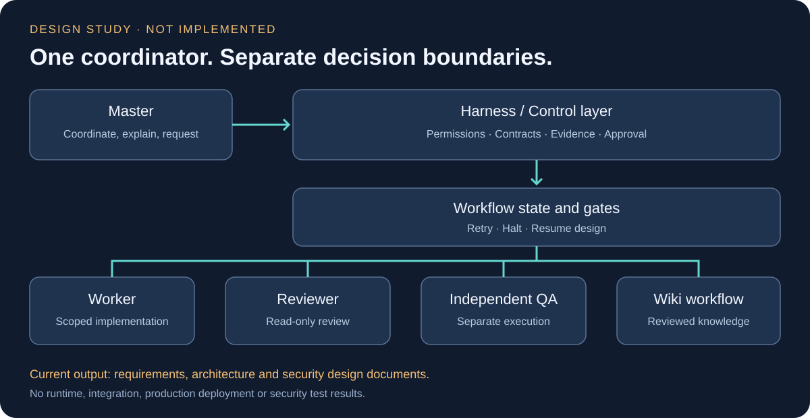

# AI Multi-Agent Development Orchestration Study

**Architecture Study · Requirements Specification · Security Design Review**

마스터 AI와 대화하면서 기획·개발·검수·QA·문서화를 역할별 에이전트에 맡기고, 실제 진행 상태는 별도 실행 제어 계층이 관리하도록 구상한 개인 설계 프로젝트입니다.

> **현재 단계: 명세·보안 설계. 시스템 구현과 실행 검증은 진행하지 않았습니다.** v1.4는 설계 문서 버전이며 소프트웨어 릴리스나 보안 인증 버전이 아닙니다. 이 저장소에는 새로 정리한 문서와 직접 작성한 설명 도식만 있습니다.

## 왜 기획했는가

여러 AI를 개별적으로 사용하는 것을 넘어, 하나의 마스터가 작업을 조율하고 다른 역할이 결과를 검수하는 흐름을 만들고자 했습니다. 출발점은 [AI 활용 설명회 영상](https://www.youtube.com/watch?v=woSiT_kytXo)에서 소개한 마스터 중심 운영, 단계별 검수와 위키 기록 방식입니다. 영상 속 구현은 제작자의 사례이며 본인의 성과가 아닙니다.

이후 요구사항·권한·증거·실패 복구·보안 경계를 AI와 논의하며 명세를 정리했습니다. 마스터의 자연어 판단과 실제 승인 권한을 분리하고, “완료했다”는 보고만으로 다음 단계로 넘어가지 않는 구조를 목표로 삼았습니다.

## 실제 진행한 일 / 아직 하지 않은 일

| 구분 | 상태 |
|---|---|
| 원하는 개발 흐름과 역할 정의 | 명세 작성 |
| 도구 후보 및 대안 비교 | 대화·문서 수준 검토 |
| v1.1~v1.4 설계 보완 | 문서 이력 존재 |
| AI 보조 보안 설계 리뷰 | 문서 수준 검토 |
| 마스터·실행 제어·상태 머신 구현 | 미착수 |
| 실제 Worker / Reviewer 연결 | 미착수 |
| 자동 QA·자동 재개·위키 갱신 | 미구현 |
| PoC 8건 및 보안 수용 테스트 32항목 | 미수행 |
| 운영 배포·성능·보안 실증 | 없음 |

**설계에 보안 요구사항을 적은 것과 실제 환경에서 강제·검증한 것은 다릅니다.** 안전성, 생산성 개선, 비용 절감, 장시간 무인 운영을 입증했다고 주장하지 않습니다.

## 핵심 설계 방향

- **Master:** 요구 해석, 작업 분해, 진행 설명. 검수·QA 결과를 임의로 뒤집지 못하도록 설계.
- **Harness:** 권한·계약·실행 근거를 확인하는 별도 제어 계층.
- **Workflow runtime:** 단계 전환, 재시도, 중단·재개 상태를 관리하는 계층.
- **Worker / Reviewer / QA:** 역할·세션·입력 맥락·권한을 구분하고 자기 검증에만 의존하지 않는 방향.
- **Evidence / Wiki:** 실행 근거와 승인된 지식을 구분해 보존하고 실패 이력도 추적하는 방향.

위 항목은 모두 **설계 목표**이며 구현 기능 목록이 아닙니다.

## 문서 안내

| 문서 | 내용 |
|---|---|
| [배경과 출처](docs/background-and-sources.md) | 영상에서 얻은 아이디어와 개인 요구사항 구분 |
| [제안 아키텍처](docs/architecture.md) | 역할, 계층, 검토 기술과 책임 경계 |
| [워크플로우 및 증거](docs/workflow-and-evidence.md) | 단계 전환, 완료 주장, 검수, QA, 실패 처리 |
| [보안 설계](docs/security-design.md) | 위협과 대응 방향, 검증되지 않은 가정 |
| [구현 상태](docs/implementation-status.md) | 문서화와 시스템 구현의 구분 |
| [구현·검증 계획](docs/roadmap-and-validation.md) | 초기 범위, PoC 8건, 수용 테스트 32항목 |
| [설계 이력과 회고](docs/design-history.md) | 명세 보완 과정과 아직 해결하지 못한 점 |
| [공개 및 외부 자료 안내](THIRD_PARTY_NOTICES.md) | 원문·개인정보·외부 자료의 공개 범위 |

## 본인의 역할

원하는 마스터형 운영 방식과 역할 분리 요구를 제시하고, 대안을 질문하며, AI가 만든 명세와 보안 리뷰의 재검토를 요청했습니다. 문서 작성과 설계 보완에 AI 도구를 활용했습니다. 전체 설계를 독자 발명했다거나 보안 전문가의 감사를 받았다는 의미는 아닙니다.

관련 채팅에서는 기존 도구만 이용하는 단순한 대안도 검토했습니다. 그 대안을 실제 운영한 기록으로 확대하지 않습니다. 공개 프로젝트와의 동등성이나 “기존에 없는 최초의 시스템”도 주장하지 않습니다.

기준 명세: 2026-09-28 v1.4 · 공개 정리: 2026-10-07. 실행 프로그램이 아니므로 설치·실행 안내는 없습니다.
