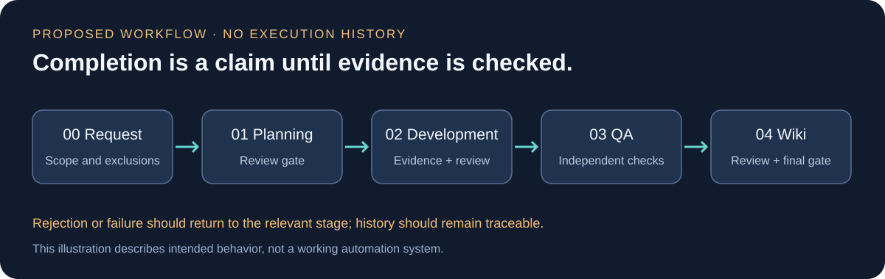

# 워크플로우와 증거 기반 승인

**아래 단계와 규칙은 설계이며 실행된 작업 이력이 아닙니다.**

| 단계 | 계획 산출물 | 다음 단계의 조건 |
|---|---|---|
| 00 요청 | 요구, 범위, 제외 사항 | 요구 명확화 |
| 01 기획 | 명세, TODO, 수용 기준 | 기획 검수 승인 |
| 02 개발 | 변경과 완료 주장, 시험 근거 | 제어 계층 확인 및 개발 검수 |
| 03 독립 QA | 실행 관찰과 assertion | 실제 기능 검증 통과 |
| 04 Wiki | 변경과 결정의 문서화 | 문서 검수 및 최종 조건 확인 |

반려 시 해당 작업을 수정하고 다시 검수하며, QA 실패 시 개발 단계로 돌아가는 흐름을 계획했습니다. 요구 자체의 변경은 별도 변경 요청으로 다뤄야 하며, 검수자가 임의로 요구사항을 고쳐 통과시키는 방식은 배제했습니다.

## 완료 주장과 검증 근거

| 수준 | 계획한 근거 | 한계 |
|---|---|---|
| E1 | Worker의 완료 주장·로그 | 그 자체만으로 승인 불가 |
| E2 | 고정된 시험 조건에서 별도 Runner가 수행한 결과 | 시험 대상과 러너가 공유하는 실행 경계의 위험이 남을 수 있음 |
| E3 | 대상과 분리된 환경에서 관찰하는 black-box QA | 정의한 시나리오의 범위 안에서만 증거가 됨 |

원 명세는 사용자 대면 기능·보안 변경에 E3를 요구합니다. 이 저장소에는 어느 수준의 실제 실행 근거도 없습니다. 표는 향후 결과를 분류하기 위한 설계입니다.

## 시험 기준의 소유권

기획 검수에서 승인한 필수 시험과 지원 파일을 기준으로 보존하고, Worker가 이를 약화하면 별도 변경 심사를 받도록 계획했습니다. 시험 개수만 남아 있다고 의미가 보존되는 것은 아니므로 단언·fixture·설정도 검토 대상입니다.

## 실패 및 중단

- 검수 반려: 문제와 수정 범위를 기록하고 같은 단계 재시도.
- QA 실패: 실패 근거를 남기고 관련 개발 단계로 복귀.
- 사용량 제한: 중단 상태를 저장하고 재개 시 조건 재확인.
- 보안 경계 위반 의심: 중단 후 별도 승인 경로로 처리.
- 프로세스 종료: 저장된 상태와 근거가 일치하는지 확인한 뒤 재개.

자동 재개는 목표일 뿐 구현되어 있지 않습니다. 무한 재시도, 사용량 제한 우회, 자동 유료 대체 경로를 구현한 기록도 없습니다.
